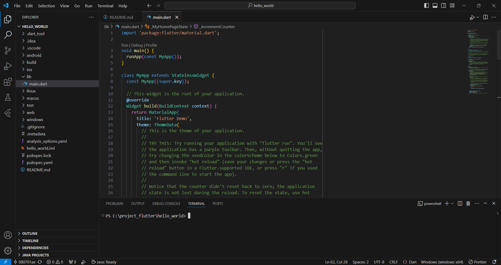

Nama    : Ahmed Fathir Syafaat

Kelas   : TI - 3H

NIM     : 2241720083

## #05 | Aplikasi Pertama dan Widget Dasar Flutter

### Praktikum 1: Membuat Project Flutter Baru

### Praktikum 2: Menghubungkan Perangkat Android atau Emulator

### Praktikum 3: Membuat Repository GitHub dan Laporan Praktikum
